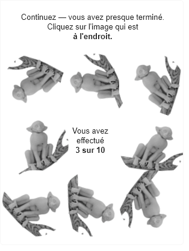

# Funcaptcha Solver (June 2020)
A simple solver for the old version of Funcaptcha. It was a side project, so the code can be rather scrappy.

# Prerequisites

- OpenCV 
- Python 3.x w/ Numpy, PIL, Pickle, OpenCV Wrapper
- Google Chrome (any version)
- Chromedriver.exe associated with your version

# How to use it ?

Even though it shouldn't work anymore, you can still try to use it. You first need to download the prerequisites.  
Once that's done, just put the chromedriver.exe in the project folder, and it should roll.

#How does it work ?

It works by first gathering a number of challenges to be used for our model. 
Once we have those challenges, we find the contours of every animal contained in the challenge and we save them as separate pictures.
We then proceed to find the animals that are in the upright position and copy them to a separate directory. This step is done manually.

Once this is done, we process all pictures to transform them into an adjusted and simplified cloud of dots. We then save all the clouds of dots in a separate file to save on load and processing time when we do the solving.

The solving is then simple : 
- we take the image of a challenge 
- we separate the animals of this challenge into individual images
- for each individual image we transform it into a cloud of dots. 
-    we compare the cloud of dots with our database, and we find the cloud of dots in our database with the smallest deviation
-    if this cloud of dots is associated to a valid image (an animal upright), we know that we need to click on the animal associated to the image
